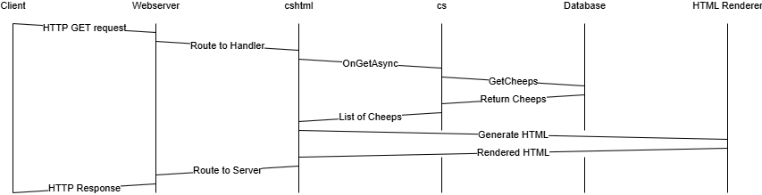
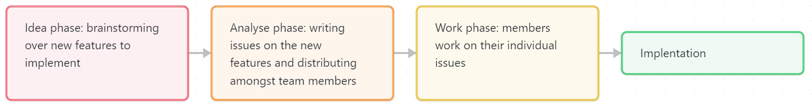

## Design and architecture

### Domain model


As illustrated, our domain model consists of three key entities: **Author**, **Cheep**, and **Follow**. 
The model integrates seamlessly with ASP.NET Identity for authentication and authorization, 
as demonstrated by the inheritance of the ``Author`` entity from ``IdentityUser``. 
This ensures access to built-in Identity properties such as ``UserName``, ``Email``, and password management features.

The **Author** entity is central to the model and includes a collection of associated cheeps, representing the one-to-many relationship between an author and their posts.

The **Cheep** entity encapsulates information about the author and the cheep itself, including:
- **CheepId**: A unique identifier for each cheep.
- **Text**: The message content, constrained to 160 characters for brevity and readability.
- **TimeStamp**: The creation time of the cheep.
- **AuthorId**: A foreign key linking the cheep to its author.

The **Follow** entity represents a many-to-many relationship between authors, where one author can follow another. This entity includes:
- **FollowerId**: The ID of the author who initiates the follow action.
- **FollowedId**: The ID of the author being followed.
- **Relationships** to the corresponding ``Author`` entities (``Follower`` and ``Followed``).

The **Follow** domain is primarily designed for write operations rather than read operations.
This approach is suitable given our context, where the number of users is minimal, and complex read optimizations are not required.

#### Validation and Constraints
To maintain data integrity:
- **Text** in the **Cheep** entity is validated to ensure it does not exceed 160 characters.
- Composite primary keys (``FollowerId`` and ``FollowedId``) in Follow prevent duplicate entries for the same follow relationship.

### Architecture — In the small


As illustrated, our code base is organized following an onion architecture, emphasizing separation of concerns and a dependency-inversion approach.
The architecture consists of four distinct layers:
1. **Domain Layer** \
This is the core of our application, containing the domain entities, core business rules, and logic. 
This layer is framework-agnostic, ensuring its independence from external dependencies.

2. **Repository Layer** \
This layer handles persistence and data access. It includes interfaces and their implementations for managing the storage and retrieval of domain entities. 
Examples include Entity Framework Core repositories for database operations.

3. **Service Layer** \
The Service Layer acts as the mediator between the Repository Layer and the Application Layer.
It contains the application’s business logic, orchestrates calls to repositories, and prepares data for the Application Layer.

4. **Application and Tests Layer** \
This outermost layer contains the presentation logic, implemented as Razor Pages or Views, which interact with end-users.
It also includes test projects to verify the functionality and integrity of the system, covering unit, integration, and end-to-end tests.

Each layer strictly depends on the layer beneath it, ensuring adherence to onion architecture principles. For example: 
- The Service Layer depends on the Repository Layer for data operations but not vice versa.
- The Repository Layer depends on abstractions defined in the Domain Layer, not concrete implementations.

This structure ensures flexibility, testability, and maintainability of the code base.

### Architecture of deployed application


We use a Client-Server architecture, which gives us three main bodies to deal with:
1. The first body is our setup of GitHub Actions workflows which handle our CI/CD.
Once the program can build, and it passes tests, it will be automatically deployed to our server.
This is the main way we interact with the program as developers.
   
2. The second body is our server, which is the heart of our interactions with clients.
We are using Microsoft Azure for hosting the server. In Azure, Chirp! is split up in two parts;
there is the database for storing all relevant information and the application itself that the client will interact with.
   
3. The third body is the client. They use HTTPS GET and POST calls to send requests and information to our application through Azure.
GET is used to load and view Chirp! in their browser and POST to send updates to our server and database.
Before they can use HTTPS, they must first establish themselves to the server with HTTP calls.

### User activities
An unauthorized user starts at the public timeline, from here they have access to all pages of the public timeline, they can also enter an author's timeline.
They can log in to an existing account via username and password, or use GitHub to log in. They can also register and create a new account, 
this can be done with either GitHub, or through using an email, username and creating a password.

After logging in a user is authorized, and get access to new functionality. You gain access to share your own cheeps, 
you can also follow other authors, and you get access to your <i>own</i> timeline. Your timeline contains all of your own cheeps
as well as all cheeps of authors you currently follow. You can also, in addition to sharing cheeps, delete cheeps and edit cheeps. 
You also get access to the about me page, where you can find all the authors you follow and the authors you are following.
You get to see your username and email, and all the cheeps sent by you, and there is also a "FORGET ME" button,
which removes all data related to your account, including follow relations, account details, and cheeps.
Doing this is permanent as we will delete the account from our server, and your data will cease to exist.
The last feature you get access to, is to log out of your account.


This UML statechart represents what user activities you can accomplish from different states.

### Sequence of functionality/calls through _Chirp!_



It starts with an HTTP GET request to the webserver, which is redirected to the application itself.
The request is from an unauthorized user of the program.

To show responses from the C#, we have split the application into the cshtml files and the cs files. 
To keep it manageable, we have elected to only show method calls between the cshtml and the cs files.
Since it is an unauthorized user, the only method call is OnGetAsync, which is automatically called on GET requests.
It queries the database for a list of cheeps which it then makes accessible to both itself and the cshtml.

Lastly, it generates the HTML which is then returned and redirected back to the server. This rendered web-page is then sent back to the client through an HTTP response.

## Process

### Build, test, release, and deployment
These following UML diagrams describe our GitHub workflows. From the left to the right we have, building and testing,
adding pull request to the project board, deploy app to azure, making releases on tags, automatic moving of issues on project board.


On the building and testing workflow we can see that it sets up a lot of tools like dotnet and playwright then it builds, runs and test the files with dotnet commands.

On the 'adding pull request to project board' workflow it gets data from GitHub, and then adds this into an item for the project board.

On the 'deploy app to Azure' workflow it sets up dotnet, builds, and makes an executable file, then makes it available as an artifact, 
then it sets up another environment with id token and then downloads the artifact from before. Next, it logs into Azure and then deploys the artifact.

On the 'making releases on tags' workflow, it sets up dotnet and dependencies, then sets up GitHub tokens in a new environment.
It then sets up dotnet in the new environment, builds and restores in the new environment, and then makes executable files for multiple operating systems.
Then zips the executables and makes a release containing the zip files.

On the 'automatic moving of issues on project board' workflow, we can see it fetches status id and progress option id from the project, then
it fetches the item id of the issue, then updates the issue status to "In Progress".

### Team work

As of the morning of the 19th of december, the thing that is mostly missing is test for the different features that have been implemented lately, and one test related issue from the CLI version of programme.

Each week when the group got new features to implement, the group sat down and made issues. 
After the issues were made, they were then distributed among members. Each member worked on their issues on individual branches. 
When the issue was done, a pull request would then be made where review would be requested. 
If two or more other group members approved, the branch would then be merged into main. 
If the branch contained new features, GitHub actions would then deploy those features to the website.



### How to make _Chirp!_ work locally

In order to clone the repository you have to run the following command, which requires you to have git installed:

```git clone https://github.com/ITU-BDSA2024-GROUP1/Chirp.git```

Once you cloned the repository you will have to set up some user-secrets since they are used for third party login.
Start by locating the files on your pc, and once you are in the Chirp folder, you should be able to run the following commands
after having dotnet-ef installed (If you have installed dotnet-ef you can skip the first command):

```dotnet tool install --global dotnet-ef```

```dotnet user-secrets set "auth_github_clientId" "Ov23liRWZA8rujaSnUGT" --project "src/Chirp.Razor/Chirp.Razor.csproj"```

```dotnet user-secrets set "auth_github_clientSecret" "6f43c9d347116d35557b9a98133177b520f97178" --project "src/Chirp.Razor/Chirp.Razor.csproj"```

To check if the user-secrets are set you can run the following command:

```dotnet user-secrets list --project "src/Chirp.Razor/Chirp.Razor.csproj"```

In case the user-secrets haven't been set you will have to set them manually which you do the following way:

1. Head to the following location and ensure a folder ```UserSecrets``` exists: C:\Users\\\<user>\AppData\Roaming\Microsoft\, where user is your pc user.
2. Then you will have to create a folder within ```UserSecrets``` that is called: 7fac5a3e-b457-40f0-8c72-57166e5bc39f 
3. Inside that folder you will have to create a file: secrets.json that will have to contain:
```json
{
  "auth_github_clientId": "Ov23liRWZA8rujaSnUGT",
  "auth_github_clientSecret": "6f43c9d347116d35557b9a98133177b520f97178"
}
```
4. Now you can go back to the Chirp folder and try the command that lists all the user-secrets for the applications as with the other method.

### How to run test suite locally

Assuming you have properly followed the steps of the previous chapter, the only required dependency, 
should be Playwright itself for the End2End tests.

Start by building the project from the root ```/Chirp/``` directory: <br>
```dotnet build```

Install Playwright using the following command in <b>PowerShell</b>, from the ```test/Chirp.RazorTest/``` directory: <br>
```bin/Test/net8.0/playwright.ps1 install```

Then, for the Playwright tests to work, you must be running the website locally, so run the Razor project from ```src/Chirp.Razor/```: <br>
```dotnet run```

Finally, run the tests themselves from the root ```/Chirp/``` directory: <br>
```dotnet test --no-build```

This should run approximately 60 tests, which are split almost half-half between infrastructure tests (36) and Razor tests (24). <br>

The infrastructure tests are unit tests of all 3 repositories and services; cheep, author, and follow. <br>
Specifically, we're unit-testing all the methods described in our repository and service interfaces. <br>

The Razor tests are all made using mostly just Playwright, and have primarily been split into End2End tests, <br>
testing the basic user functionality (log-in, cheep, edit, forget-me), bad user-interactions (username taken, bad password, etc.), and bad-actor attacks (e.g. XSS). <br>

## Ethics

### License

We have chosen to use an MIT license for our project since it is an open source project that is open to the public on GitHub,
where anybody is allowed to use it if they choose to as long as they credit us.

There are two main considerations we had when comparing it to a copyleft license like GNU GPLv3:
1. The first is whether we were using a dependency that used a copyleft license, since that would require us to either use the same license or an even more restrictive one.
2. The second is whether we wanted a copyleft license at all, which we didn't. 

As for why we chose the MIT license specifically; most if not all of our dependencies at the time used it, and we liked it, so we went with it.
### LLMs, ChatGPT, CoPilot, and others

CoPilot was used for generating some css, fixing errors in code, explaining stuff from Microsoft documentation that was hard to understand,
and pros and cons for different ways of designing code.

ChatGPT was used a lot when we were dealing with GitHub Actions since there was not a lot of documentation about it
and a lot of help found on the internet varied greatly in usability. It was also used for RazorPages and especially error-handling.
In general, we mostly used it to help where our knowledge ran short and where some google searching didn't provide a useful answer;
it was not used to just write code we could ourselves but didn't want to.

The LLMs were largely quite helpful for the development since we used it to supplement information we would otherwise spend very long to find through googling,
if we could even find it. Though there were also some times were it led us on a bit of wild-goose chase.
But largely, we would say that it sped up development far more than slow it down.